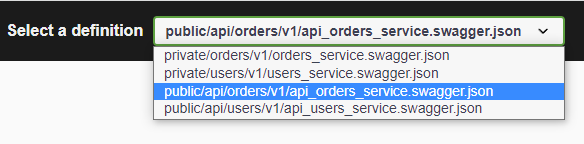

# enhanced-grpc-api-gateway-example

## Introduction

This repository brings together two existing repositories that demonstrate gRPC. The "enhancement" is to Konstantin Ostrovsky's API Gateway demonstration:
<https://github.com/kostyay/grpc-api-gateway-example>.
Konstantin has an excellent blog that describes the architecture: <https://daily.dev/blog/api-gateway-for-grpc-microservices>.

A web search of "GPRC gateway" is sure to bring you here: <https://github.com/grpc-ecosystem/grpc-gateway>. Scrolling down through the README, you get to a video introduction: <https://www.youtube.com/watch?v=Pq1paKC-fXk>. What fascinated me with Johan Brandhorst's demo was the use of an OpenAPI user interface running in a web browser. Within the organization where I work, we specify our RESTful interfaces with OpenAPI. Johan's repository  <https://github.com/johanbrandhorst/grpc-gateway-boilerplate> uses the Buf CLI (versus protoc within Konstantin's Makefile). We make extensive use of linters within our organization and Johan's Makefile has an option to lint the .proto files. Hence, my curiousity was now piqued to add OpenAPI and use the Buf CLI in Konstantin's repository.

I resisted the urge to change Konstantin's microservices. My one addition was to add code to the api-gw microservice to replace the following function to avoid bringing down the API Gateway microservice when doing a `GET` on `/api/v1/users`:

```go
func (u *usersService) ListUsers(ctx context.Context, request *pb.ListUsersRequest) (*pb.ListUsersResponse, error) {
    panic("implement me")
}
```

## Contents

Like Konstantin's repository, this one contains three microservices:

* `users` - Internal Users microservice
* `orders` - Internal Orders microservice
* `api-gw` - External API gateway microservice

It includes the client:

* `apigw-client` - A simple client calling ListOrdersWithUser endpoint.

`third-party` contains dynamically-generate Swagger documentation.

## Working with the project

* `make clean` - Removes all generated files (Go binaries, Swagger documentation, protoc-gen-go output)
* `make lint` - Lints .proto files
* `make generate` - Generates the Go client protocol buffers code
* `make build` - Build the binaries for each of the microservices
* `make run-servers` - Starts the microservices

After starting the microservices in one shell (`make run-servers`), in a second shell, `cd` to `apigw-client` and run the client: `go run main.go`

While the microservices are running, from a web browser, navigate to `https://localhost:11000/` In the "select a definition" dropdown, select `smpl/api/orders/v1/api_orders_service.swagger.json` This definition is the external interface to the Orders microservice exposed by the API gateway (vs. `smpl/orders/v1/orders_service.swagger.json` that is the private interface).



Try it out/Execute on `GET /api/v1/orders` results in a response:


